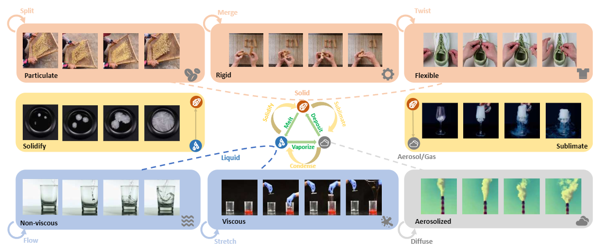

# M3-VOS: Multi-Phase, Multi-Transition, and Multi-Scenery Video Object Segmentation
### 📝[Paper](https://arxiv.org/abs/2412.13803) | 🌍[Project Page](https://zixuan-chen.github.io/M-cube-VOS.github.io/) | 🤗[Tools](https://github.com/Lijiaxin0111/SemiAuto-Multi-Level-Annotation-Tool) | 🛢️[Data](https://drive.google.com/drive/folders/1qNSvE6dpkCHSs_8eZRo6vruLScCHl7oI?usp=sharing)



## 1. Installation
```bash
# Clone this repo
git clone https://github.com/zixuan-chen/M3VOS_Experiment.git
cd M3VOS_Experiment

# Create a Conda environment
conda create -n mvos python=3.10.0
conda activate mvos

# Install pytorch
# Look up https://pytorch.org/get-started/previous-versions/ with your cuda version for a correct command
pip install torch==2.1.2 torchvision==0.16.2  --index-url https://download.pytorch.org/whl/cu121

pip install git+git://github.com/cheind/py-thin-plate-spline
# Install other prequisites
pip install -r requirements.txt
# for other methods you should look for their requirements in their respective folders.
```

## 2. Annotation Tool
We put our annotation tool in [an independent GitHub repository](https://github.com/Lijiaxin0111/SemiAuto-Multi-Level-Annotation-Tool).

## 3. Evaluation

[Running Cutie_ReVOS and other methods on video object segmentation data.](docs/EVALUATION.md)

## 4. Training
Training Cutie_ReVOS are similar to [training Cutie](]/methods/Cutie/docs/TRAINING.md)


## 5. Useful scripts

in the `./scripts`

- `merge_signle_video.py`:  merge the mask and image into a video  , args:
  - `images_folder`:  a folder contains images: `001.jpg`  , `002.jpg`, ...
  - `masks_folder`:  a folder contains masks: `001.png`  , `002.png`, ...
  - `output_video`： `*.mp4`
- `merge_png2video.py`: process the dataset whose file structure just like `VOST`, get the merge videos folder
  - `images_folder`:  a folder contains the images of seqs:  just like `ROVES_summary/ROVES_week_0/JPEGIMages `
  - `masks_folder`:  a folder contains he masks of  seqs: `ROVES_summary/ROVES_week_0/Annotations`
  - `output_video`：a target folder contains  merge videos : `exp/merge_videos`
- `align_direction.py`: If you find the width of your video is more than its height , it will rotate it 90 degree  counterclockwisely.

## Citation
```
@InProceedings{chen2024m3vos_2025_CVPR,
    author    = {Zixuan Chen and Jiaxin Li and Liming Tan and Yejie Guo and Junxuan Liang and Cewu Lu and Yong-Lu Li},
    title     = {M$^3$-VOS: Multi-Phase, Multi-Transition, and Multi-Scenery Video Object Segmentation},
    booktitle = {Proceedings of the IEEE/CVF Conference on Computer Vision and Pattern Recognition (CVPR)},
    month     = {June},
    year      = {2025}
}
```

